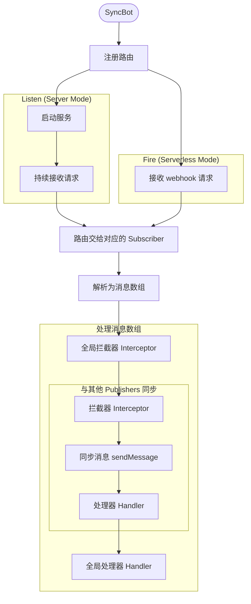

> SyncBot 仍在开发中，我们会在开发完毕后发布 Release.

# SyncBot

<!-- [](https://badge.fury.io/js/syncbot) -->
[](https://opensource.org/licenses/MIT)

**SyncBot** 是一个可扩展的、为 Webhook 而做的 TypeScript 机器人流程框架，旨在轻松实现不同聊天平台、服务或 API 之间的消息同步。

不仅如此，您可以轻松编写插件系统，来编写自己的信息处理逻辑。

我们在初期准备支持 Telegram（收/发），Discord（发），您也可以自己编写自己的适配器，一次编写就可以支持本机器人。

同时我们支持 Node.js 服务器和 Serverless 环境，具体请看「快速开始」部分。

## ✨ 特性

- **🔌 统一的适配器接口**: 只需编写适配器，轻松集成任何消息源或目标。
- **🚀 插件化架构**: 使用插件方法，可以轻松地为您的机器人添加新功能或集成第三方服务。
- **⚙️ 中间件支持**: 通过添加处理方法，可以在消息处理流程的任何阶段添加处理器，以实现日志记录、权限控制、消息修改等功能。
- **🔒 类型安全**: 完全使用 TypeScript 编写，提供强大的类型推断和编译时检查。
- **🌐 灵活部署**: 同时支持在传统的 Node.js 服务器 (`listen()`) 和 Serverless 环境 (`fire()`) 中运行。
- **💬 提供 utils**: 内置便捷方法，轻松处理 Markdown、HTML 的转换，并且提供了不支持富文本的后备处理。

## 📦 安装

```bash
npm install https://github.com/HackHTU/syncbot
```

## 🚀 快速开始

下面是一个简单的例子，演示了如何创建一个在同步消息的机器人。

```typescript
import SyncBot from 'syncbot';

// 1. 创建 Bot
// 2. 订阅/发布一个消息源

// 3. 采用 Node.js Server 或 Serverless
```

## 核心概念

Webhook 是一种事件驱动的、基于 HTTP 的回调机制，它允许一个应用程序在特定事件发生时，自动将数据推送给另一个应用程序。

我们在传入 Webhook 请求时，会通过适配器的 `id` 来识别需要哪一种适配器处理，然后解析请求为一个消息数组，接下来我们对于消息，拦截器->同步消息给其他适配器->处理器。



### 适配器

适配器是 SyncBot 与第三方消息源沟通的桥梁，他们通过 `id` 建立的来建立路由。

如果你要编写自己的适配器，请继承以下接口。

- **`SubscribableAdaptor`**: 只接收消息。它必须实现一个 `id` 和一个 `receive` 方法。SyncBot 会为每个订阅者创建一个 webhook 端点 (`POST /<adaptor_id>`)。
- **`PublishableAdaptor`**: 只发送消息。它必须实现一个 `id` 和至少一个 `sendText` 方法。
- **`SyncableAdaptor`**: 既能接收也能发送消息，是 `Subscribable` 和 `Publishable` 的结合。

```typescript

```

### 消息

所有通过 SyncBot 流转的数据都被封装成 `Message` 对象。它有一个 `type` 字段（如 `'text'`, `'media'`, `'location'`）来区分不同类型的消息。

```json
{
  "type": "text"
}
```

某些适配器可能无法处理复杂类型的媒体，你需要在编写适配器时添加 `alt: string` 参数作为 fallback，我们会转换为文字消息处理。

```json
{
    type: 'location',
    //...

    alt: '${content.longitude}, ${content.latitude}',
    //...
}
```

### 处理器

处理器是可以在消息生命周期的特定节点执行的函数，类似于中间件。

SyncBot 有自己的全局处理器，分配到每个适配器时也有自己的处理器。

#### 拦截器

**`Interceptor`**: 在消息被同步给其他发布者 **之前** 执行。可以用于消息验证、修改或过滤。

#### 处理器

**`Handler`**: 在消息被同步给所有发布者 **之后** 执行。可以用于日志记录、分析或收尾工作。

您可以通过 `.intercept()` 和 `.handle()` 方法注册，他根据 `priority` 属性（数字越小，优先级越高）的顺序执行。

```typescript
bot.intercept({
  name: 'process before syncing',
  priority: 1,
  process: processor1,
});

bot.handle({
  name: 'process after syncing',
  priority: 1,
  process: processor2,
});
```

### 插件

您可以通过 `.use()` 方法来添加插件。

## 🤝 贡献

欢迎提交 Pull Requests 和 Issues！

## TODO
1. 便捷添加命令/便捷筛选
2. 状态管理/持久化存储插件
3. i18n

## 📄 许可证

[MIT](./LICENSE)
